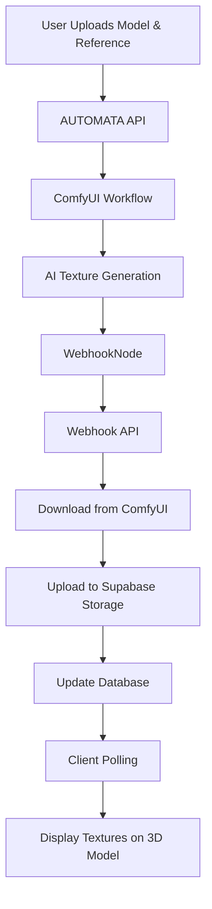

# TextureGen: AI-Powered 3D Texture Generation

TextureGen is an innovative web application that revolutionizes the 3D texturing workflow by allowing artists and developers to generate high-quality, AI-powered PBR (Physically Based Rendering) textures directly in the browser. Simply upload your 3D model, provide a reference image and text prompts, and watch as AI creates professional-grade textures in real-time.


## ✨ Features

### **Core AI Generation**
- **🎨 AI Texture Generation**: Generate diffuse, normal, and height maps using advanced AI models
- **🖼️ Interactive 3D Viewer**: Real-time preview with React Three Fiber
- **⚡ Progressive Enhancement**: Fast preview mode with optional high-quality upgrades
- **🔄 Real-time Updates**: Webhook-based system for instant texture delivery

### **Professional UI/UX**
- **📱 Modern Bento Layout**: Beautiful sidebar layout with smooth animations powered by Framer Motion
- **🎬 Intro Animations**: Professional company logo and app branding animations
- **🌓 Dark/Light Theme**: Complete theme system with proper color consistency
- **📚 Generation Gallery**: View and manage your texture generation history with advanced controls
- **⚙️ Advanced Settings**: Customizable style templates and generation parameters

### **Enterprise Architecture**
- **🔐 Secure Authentication**: User management with Supabase Auth
- **☁️ Hybrid Storage**: Automatic upload to Supabase Storage with ComfyUI fallbacks
- **🌐 Multi-Environment Support**: Seamless local development and production deployment
- **🏢 Corporate Network Ready**: Multiple deployment strategies for enterprise environments
- **🔧 Flexible ComfyUI Integration**: Local, cloud, or tunneled ComfyUI connections

## 🏗️ Architecture

### Tech Stack

| Component | Technology | Purpose |
|-----------|------------|---------|
| **Frontend** | Next.js 14 + TypeScript | Modern React framework with App Router |
| **3D Rendering** | React Three Fiber + Drei | Interactive 3D model viewing |
| **AI Generation** | ComfyUI + Custom Webhook | Advanced texture generation pipeline |
| **Authentication** | Supabase Auth | Secure user management |
| **Database** | Supabase PostgreSQL | Generation tracking and metadata |
| **Storage** | Supabase Storage | Cloud file storage with CDN |
| **State Management** | Zustand | Lightweight global state |
| **Styling** | Tailwind CSS | Utility-first styling |
| **Animations** | Framer Motion | Smooth UI transitions |

### System Flow



## 🚀 Quick Start

### Prerequisites

- **Node.js** 18+ 
- **ComfyUI** instance with required models
- **Supabase** project
- **Git** for cloning

### 1. Clone and Install

```bash
git clone https://github.com/dudumaluf/BOT_TextureGen.git
cd BOT_TextureGen
npm install
```

### 2. Environment Setup

Create `.env.local` in the project root:

```bash
# Supabase Configuration
NEXT_PUBLIC_SUPABASE_URL=your_supabase_project_url
NEXT_PUBLIC_SUPABASE_ANON_KEY=your_supabase_anon_key

# ComfyUI Integration
COMFYUI_API_URL=http://localhost:8188
COMFYUI_WS_URL=ws://localhost:8188/ws
NEXT_PUBLIC_COMFYUI_API_URL=http://localhost:8188
NEXT_PUBLIC_COMFYUI_WS_URL=ws://localhost:8188/ws

# Webhook Security (Optional for development)
COMFYUI_WEBHOOK_SECRET=your_secure_random_string

# Application URLs
NEXTAUTH_URL=http://localhost:3000
```

### 3. Database Setup

Run the SQL migrations in your Supabase dashboard:

```sql
-- Run the contents of supabase/migrations/0001_consolidated_schema.sql
-- This creates the models and generations tables with proper RLS policies
```

### 4. Storage Buckets

Create these public buckets in Supabase Storage:
- `models` - For uploaded 3D models
- `reference-images` - For reference images  
- `generated_textures` - For AI-generated textures

### 5. ComfyUI Setup

1. **Copy WebhookNode to ComfyUI:**
   ```bash
   cp WebhookNode.py /path/to/ComfyUI/custom_nodes/
   ```

2. **Install Python dependencies in ComfyUI environment:**
   ```bash
   pip install requests pillow numpy torch
   ```

3. **Restart ComfyUI** to load the custom node

4. **Verify installation** - Look for "AUTOMATA" category with "Send to Webhook" node

### 6. Run the Application

```bash
npm run dev
```

Open [http://localhost:3000](http://localhost:3000) in your browser.

## 📋 Usage

1. **Sign up/Login** with your email
2. **Upload a 3D model** (.glb format)
3. **Upload a reference image** for texture style
4. **Enter prompts** describing the desired texture
5. **Click "Generate Textures"** and wait for AI processing
6. **View results** applied to your 3D model in real-time
7. **Browse gallery** to see your generation history

## 🔧 ComfyUI Workflow

AUTOMATA uses a sophisticated ComfyUI workflow that includes:

- **Hunyuan3D** models for 3D-aware generation
- **Multi-view rendering** for consistent textures
- **PBR material generation** (diffuse, normal, height maps)
- **Advanced upscaling** and refinement
- **Custom WebhookNode** for automatic delivery

The workflow automatically:
1. Loads your 3D model
2. Renders multiple camera views
3. Applies reference image conditioning
4. Generates high-resolution textures
5. Creates normal and height maps
6. Delivers results via webhook

## 🌐 Deployment Options

AUTOMATA supports multiple deployment architectures to fit different environments and requirements:

### **🏠 Local Development**
Perfect for development and testing:
```bash
# Local ComfyUI
COMFYUI_API_URL=http://localhost:8188
NEXT_PUBLIC_COMFYUI_API_URL=http://localhost:8188

# Local development
NEXTAUTH_URL=http://localhost:3000
```

### **☁️ Full Cloud Deployment**
For production with cloud ComfyUI:
```bash
# Cloud ComfyUI instance
COMFYUI_API_URL=https://your-comfyui-server.com
NEXT_PUBLIC_COMFYUI_API_URL=https://your-comfyui-server.com

# Production URL
NEXTAUTH_URL=https://your-app.vercel.app
```

### **🌉 Hybrid: Local ComfyUI + Cloud App**
For corporate environments with local AI processing:
```bash
# Tunneled local ComfyUI (via Cloudflare Tunnel)
COMFYUI_API_URL=https://your-tunnel.trycloudflare.com
NEXT_PUBLIC_COMFYUI_API_URL=https://your-tunnel.trycloudflare.com

# Cloud app
NEXTAUTH_URL=https://your-app.vercel.app
```

### **🏢 Corporate Network Solutions**

#### **Option 1: Cloudflare Tunnel (Recommended)**
```bash
# Install Cloudflare Tunnel
npm install -g cloudflared

# Create secure tunnel to local ComfyUI
cloudflared tunnel --url localhost:8188

# Use generated HTTPS URL in Vercel environment variables
```

#### **Option 2: ngrok Professional**
```bash
# Professional ngrok with static subdomain
ngrok http 8188 --subdomain=your-company-comfyui

# Use static URL: https://your-company-comfyui.ngrok.io
```

#### **Option 3: VPN + Port Forwarding**
Work with IT to configure secure port forwarding through corporate VPN.

### **📋 IT Collaboration Checklist**

**Present to IT Department:**
- [ ] **Business justification**: AI texture generation for 3D development
- [ ] **Security requirements**: Internal AI processing, no external data sharing  
- [ ] **Technical specs**: HTTPS tunnel to port 8188, webhook callbacks
- [ ] **Compliance**: All sensitive data remains on internal networks
- [ ] **Monitoring**: Full audit trail and access controls

**Approved Solutions Ranking:**
1. 🥇 **Cloudflare Tunnel** - Zero firewall changes, enterprise security
2. 🥈 **Corporate VPN** - IT-controlled, secure internal routing  
3. 🥉 **ngrok Professional** - Static domains, better monitoring

## 🔐 Security Features

- **Row Level Security (RLS)** - Users can only access their own data
- **Webhook Authentication** - Secure communication between ComfyUI and app
- **File Upload Validation** - Secure file handling with type checking
- **Session Management** - Secure authentication with Supabase Auth

## 🎯 Key Innovations

### 1. Custom ComfyUI WebhookNode Integration
Revolutionary direct integration with ComfyUI's processing pipeline:
- **Tensor-to-Image Processing** - Direct capture of AI generation outputs
- **Automatic File Management** - Seamless saving and URL generation
- **Real-Time Notifications** - Instant completion alerts via webhooks
- **Error Recovery** - Robust fallback mechanisms for reliability

### 2. Bulletproof Real-Time System
Multi-layer redundancy ensures textures always reach users:
- **Generation-Specific Polling** - Tracks individual generation completion
- **Progress Feedback** - Real-time updates every minute during processing
- **Automatic Recovery** - 45-minute timeout with graceful degradation
- **Manual Fallbacks** - Always-available user controls

### 3. Hybrid Storage Architecture
Optimized for both development speed and production scalability:
- **Development Mode** - Direct ComfyUI serving for fast iteration
- **Production Mode** - Automatic Supabase Storage upload with global CDN
- **Intelligent Fallbacks** - ComfyUI URLs when cloud upload fails
- **Performance Optimization** - Efficient caching and delivery

### 4. Professional UI/UX Design
Modern interface built for production use:
- **Sidebar Layout** - Clean separation of controls and 3D viewer
- **Framer Motion Animations** - Smooth, professional transitions
- **Intro Animation System** - Professional company and app branding
- **Dark/Light Theme Support** - Complete theme system with proper color consistency
- **Modal Gallery System** - Beautiful grid-based generation history
- **Advanced Settings Panel** - Customizable style templates and parameters
- **Real-Time Asset Preview** - Live texture thumbnails and previews

## 📁 Project Structure

```
texturegen/
├── src/
│   ├── app/                    # Next.js App Router
│   │   ├── api/               # API routes
│   │   │   ├── generate/      # Texture generation endpoint
│   │   │   ├── webhook/       # ComfyUI webhook handler
│   │   │   └── upload-*/      # File upload endpoints
│   │   ├── login/             # Authentication page
│   │   └── page.tsx           # Main application
│   ├── components/            # React components
│   │   ├── 3d/               # 3D viewer components
│   │   ├── auth/             # Authentication components
│   │   ├── layout/           # Layout and UI components
│   │   └── ui/               # Base UI components
│   ├── lib/                  # Utilities and integrations
│   │   ├── comfyui.ts        # ComfyUI API client
│   │   ├── supabase*.ts      # Database clients
│   │   ├── webhook-security.ts # Webhook authentication
│   │   └── workflow.json     # ComfyUI workflow definition
│   └── store/                # Zustand state management
├── supabase/
│   └── migrations/           # Database schema
├── docs/                     # Documentation
├── WebhookNode.py           # ComfyUI custom node
└── public/                  # Static assets
```

## 🛠️ Development

### Adding New Texture Types

1. **Update WebhookNode.py** - Add new input connections
2. **Modify workflow.json** - Connect new generation nodes
3. **Update database schema** - Add new storage path columns
4. **Update UI components** - Display new texture types

### Customizing the Workflow

The ComfyUI workflow can be modified to:
- **Change AI models** - Swap checkpoint files
- **Adjust generation parameters** - Modify steps, CFG, etc.
- **Add new texture types** - Roughness, metallic, etc.
- **Implement style transfer** - Different artistic styles

## 🐛 Troubleshooting

### Common Issues

**ComfyUI Connection Failed:**
- Verify ComfyUI is running on port 8188
- Check CORS is enabled: `--enable-cors-header`
- Ensure WebhookNode.py is in custom_nodes/

**Textures Not Appearing:**
- Check browser console for image loading errors
- Verify ComfyUI URLs are accessible
- Check Supabase Storage bucket permissions

**Webhook Failures:**
- Verify webhook URL is reachable from ComfyUI
- Check webhook secret configuration
- Monitor both ComfyUI and AUTOMATA console logs

### Debug Mode

Enable detailed logging by checking browser console and server logs:
- **ComfyUI Console**: Shows WebhookNode processing
- **TextureGen Console**: Shows webhook reception and processing
- **Browser Console**: Shows texture loading and 3D rendering

## 📈 Performance Optimization

- **Texture Caching**: Generated textures cached in Supabase Storage
- **Optimized 3D Rendering**: Efficient Three.js usage with proper disposal
- **Lazy Loading**: Components loaded on demand
- **Image Optimization**: Next.js automatic image optimization

## 🤝 Contributing

1. Fork the repository
2. Create a feature branch
3. Make your changes
4. Test thoroughly
5. Submit a pull request

## 📄 License

MIT License - see LICENSE file for details.

## 🙏 Acknowledgments

- **ComfyUI** - Powerful node-based AI workflow system
- **Hunyuan3D** - Advanced 3D-aware generation models
- **Supabase** - Backend-as-a-Service platform
- **React Three Fiber** - Declarative 3D in React
- **Next.js** - The React framework for production

---

**Built with ❤️ for the 3D art and game development community**

*Transform your 3D models with the power of AI - no complex software required.*

## 🌟 Live Demo

**Experience TextureGen in action:**
- **Live Application**: [https://bot-texturegen.vercel.app](https://bot-texturegen.vercel.app)
- **GitHub Repository**: [https://github.com/dudumaluf/BOT_TextureGen](https://github.com/dudumaluf/BOT_TextureGen)

**Deployment Status:** ✅ **Production Ready**
- 🎨 Full AI texture generation pipeline
- 🌓 Complete dark/light theme system
- 🎬 Professional intro animations
- 🏢 Corporate network compatible (Cloudflare Tunnel integration)
- ⚡ Progressive enhancement with fast preview + high quality modes