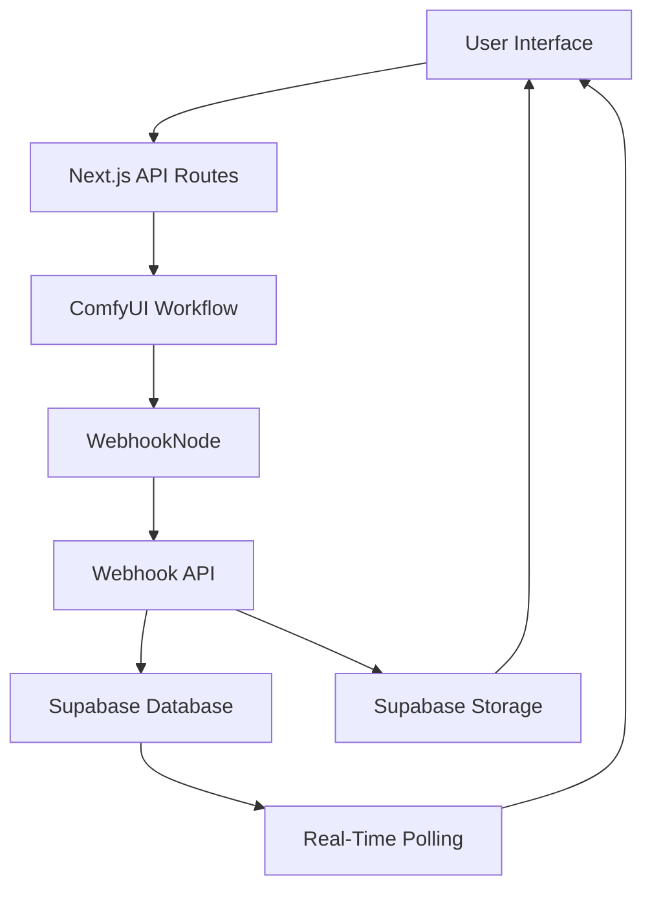

# AUTOMATA System Architecture

## Overview

AUTOMATA is a production-ready AI-powered texture generation system built with modern web technologies and a sophisticated webhook-based architecture. The system provides seamless integration between ComfyUI's powerful AI generation capabilities and a beautiful React-based web interface.

## Core Architecture



## Component Breakdown

### Frontend Layer
- **Framework:** Next.js 14 with App Router
- **3D Rendering:** React Three Fiber + Drei
- **State Management:** Zustand
- **Styling:** Tailwind CSS + Framer Motion
- **Real-Time Updates:** Generation-specific polling system

### Backend Layer
- **API Routes:** Next.js serverless functions
- **Database:** Supabase PostgreSQL with RLS
- **Storage:** Supabase Storage with CDN
- **Authentication:** Supabase Auth with SSR

### AI Generation Layer
- **Engine:** ComfyUI with Hunyuan3D models
- **Integration:** Custom WebhookNode for automatic delivery
- **Workflow:** Advanced multi-view texture generation
- **Output:** PBR textures (diffuse, normal, height maps)

## Data Flow

### 1. Generation Request
```
User Input → API Validation → Database Record → ComfyUI Workflow Queue
```

### 2. AI Processing
```
ComfyUI Loads Model → Multi-View Rendering → AI Texture Generation → File Saving
```

### 3. Completion Notification
```
WebhookNode Captures Output → HTTP Webhook Call → Database Update → Storage Upload
```

### 4. Real-Time Delivery
```
Polling System Detects → Texture Loading → 3D Model Update → User Notification
```

## Key Innovations

### 1. Custom WebhookNode
- **Tensor Processing:** Direct integration with ComfyUI's tensor outputs
- **File Management:** Automatic saving and URL generation
- **Error Handling:** Robust error recovery and logging
- **Flexibility:** Handles both raw tensors and SaveImage outputs

### 2. Bulletproof Polling System
- **Generation-Specific:** Tracks individual generation completion
- **Progress Feedback:** Real-time progress updates every minute
- **Timeout Protection:** 45-minute safety limit with graceful degradation
- **Error Recovery:** Automatic retry and fallback mechanisms

### 3. Hybrid Storage Strategy
- **Development:** Direct ComfyUI serving for fast iteration
- **Production:** Automatic Supabase Storage upload with CDN delivery
- **Fallback System:** ComfyUI URLs when cloud upload fails
- **Performance:** Optimized for both local development and global deployment

### 4. Multi-Layer Redundancy
- **Layer 1:** Automatic polling every 15 seconds
- **Layer 2:** ComfyUI webhook notifications
- **Layer 3:** Database webhooks for monitoring
- **Layer 4:** Manual check buttons for user control

## Security Architecture

### Authentication & Authorization
- **User Management:** Supabase Auth with email/password
- **Session Handling:** SSR-compatible session management
- **API Protection:** Route-level authentication checks
- **Database Security:** Row Level Security (RLS) policies

### Webhook Security
- **Secret Validation:** Optional webhook secret verification
- **Request Validation:** Comprehensive payload validation
- **Error Handling:** Secure error responses without data leakage
- **Rate Limiting:** Built-in protection against abuse

## Performance Optimizations

### Frontend Performance
- **Code Splitting:** Automatic Next.js optimization
- **Image Optimization:** Next.js Image component with CDN
- **3D Rendering:** Efficient Three.js usage with proper disposal
- **State Management:** Optimized Zustand store structure

### Backend Performance
- **Serverless Functions:** Auto-scaling API routes
- **Database Optimization:** Indexed queries and efficient schemas
- **Storage Optimization:** CDN delivery with proper caching headers
- **Webhook Efficiency:** Parallel processing and timeout handling

## Deployment Architecture

### Development Environment
- **Local ComfyUI:** Direct connection to localhost:8188
- **Local Database:** Supabase cloud with local development
- **Hot Reload:** Next.js development server with Fast Refresh
- **Debug Tools:** Comprehensive logging and error reporting

### Production Environment
- **Vercel Hosting:** Serverless deployment with global edge network
- **Supabase Cloud:** Managed PostgreSQL and storage
- **CDN Delivery:** Global content delivery network
- **Monitoring:** Error tracking and performance monitoring

## Scalability Considerations

### Horizontal Scaling
- **Serverless Architecture:** Auto-scaling API functions
- **Database Scaling:** Supabase managed scaling
- **Storage Scaling:** Unlimited cloud storage
- **ComfyUI Scaling:** Multiple instance support ready

### Vertical Optimizations
- **Memory Management:** Efficient texture processing
- **CPU Optimization:** Optimized polling intervals
- **Network Optimization:** Compressed transfers and caching
- **Storage Optimization:** Efficient file formats and compression

## Monitoring & Observability

### Application Monitoring
- **Error Tracking:** Comprehensive error logging
- **Performance Metrics:** Response time and throughput monitoring
- **User Analytics:** Generation success rates and usage patterns
- **System Health:** Database and storage health monitoring

### ComfyUI Integration Monitoring
- **Webhook Success Rates:** Track webhook delivery success
- **Generation Times:** Monitor AI processing performance
- **Error Rates:** Track and alert on generation failures
- **Resource Usage:** Monitor ComfyUI resource consumption

## Future Architecture Enhancements

### Real-Time Improvements
- **WebSocket Integration:** True real-time updates
- **Server-Sent Events:** Persistent connection management
- **Supabase Realtime:** Database change subscriptions
- **Push Notifications:** Mobile and desktop notifications

### AI Pipeline Enhancements
- **Model Versioning:** Support for multiple AI model versions
- **Batch Processing:** Multiple generation queuing
- **Style Transfer:** Advanced style and content separation
- **Quality Control:** Automatic quality assessment and retry

### Enterprise Features
- **Multi-Tenancy:** Organization and team support
- **API Gateway:** RESTful API for external integrations
- **Workflow Customization:** User-defined generation workflows
- **Resource Management:** Quota and billing integration
